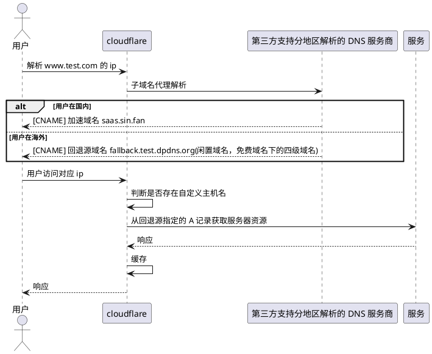

# Cloudflare 优选

> 总的来说，优选分为两种情况，worker/pages 或者普通的后端服务，而后端服务又可以再分单域名和双域名优选。
>
> 本文不讲原理(也不懂 Cloudflare 的内部细节)，所以只讲操作。

## Worker 优选

worker 优选的前提是需要已经部署了一个 worker 服务，并且具备自己的域名。

配置方法如下：

1. 设置 `workers 路由`：添加自己的域名路由。假设三级域名是 www.test.com，需要以这个来访问 worker 服务，那么就配置 `workers 路由` 为 `www.test.com/*` ，然后指向你的 worker 服务
2. 设置加速域名 cname：以 saas.sin.fan 加速域名为例，在域名记录中，设置**不加**小黄云的  `CNAME` 记录，名称就是 www，值就是加速域名 `saas.sin.fan`

## 服务优选

### 双域名优选

先讲网络上最常见的双域名优选。它的优点是灵活度高，缺点是需要两个域名，但一般第二个域名可以通过常见的免费域名提供商(eg. dpdns)来获得。

假设你想让用户通过 www.test.com 来访问你的网站并获得加速，然后你同时还有一个闲置的 test.dpdns.org 域名(你能拿到的就已经是三级域名)，那么就可以采用这种方法。

配置方法如下：

1. 你的用户访问(主)域名实际上托管 Cloudflare 还是在第三方都可以，重要的是这个服务商需要支持**分地区解析**。因此总的来说，主域名有两种托管方式：
    1. 直接托管在想腾讯云这样的服务商，本身就支持了分地区解析
    2. 托管在 Cloudflare 上，但是将三级域名或者说子域名托管在支持**子域名接入** + **分地区解析**的服务商上
2. 设置回退域名，一般该域名是你的闲置域名，这里以 test.dpdns.org 为例。回退域名是**一定**要托管在 Cloudflare 上的，子域名也必须配置在 Cloudflare 上。具体来说，假设我设置名为 fallback 的 A 记录作为回退域名，同时**开启**小黄云。那么此时就是 fallback.test.dpdns.org 指向我的后端 ip。
3. 在 **`test.dpdns.org`** 的设置界面，在 SSL/TLS -> 自定义主机名栏目中添加回退源和自定义主机名：
    1. 点设置回退源，这个即为上一步配置过小黄云的回退域名
    2. 点添加自定义主机名，主机名即为用户访问域名 www.test.com，自定义源服务器可以选择「默认源服务器」，也可以选择「自定义源服务器」设置为上面的回退源。但如果你还有其他的限制域名可用做回退源，这里也可自定义否则，否则保持用默认的即可
4. 配置分地区解析：
    1. 国内用户，需要 CNAME 到加速域名，我常用的是 `saas.sin.fan`
    2. 海外用户，需要 CNAME 到回退域名，即 `fallback.test.dpdns.org`

## 单域名优选

建设中...
