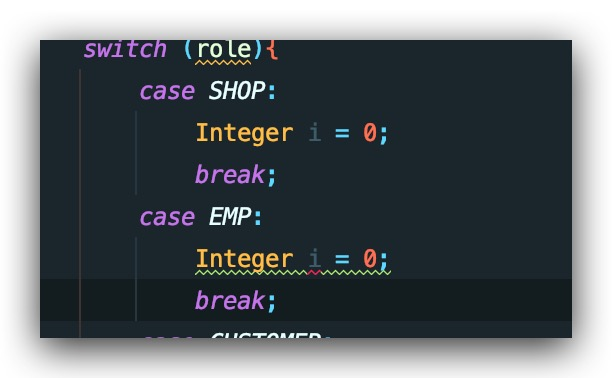

今天群里有人提到关于switch作用域的问题。



图中两个同名的变量会发生冲突而无法通过编译，究其原因是变量作用域的问题。我们都知道大部分编程语音用一对大括号来界定变量作用域，Java也同样如此。回到上图，在switch后跟了一对大括号，因此也界定了一个作用域，虽然是在不同的case中，但冒号(":")并不会扩大作用域，因此为了顺利通过编译需要在case后面新添一对括号以提升case后的作用域以与其他case区分开，如下图

```java
switch (role) {
    case SHOP: {
        Integer i = 0;
        break;
    }
    case EMP: {
        Integer i = 0;
        break;
    }
}
```

写成这样便可在一个switch中出现多个重名变量。
